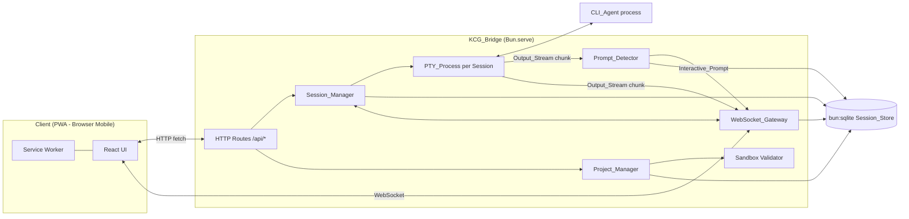
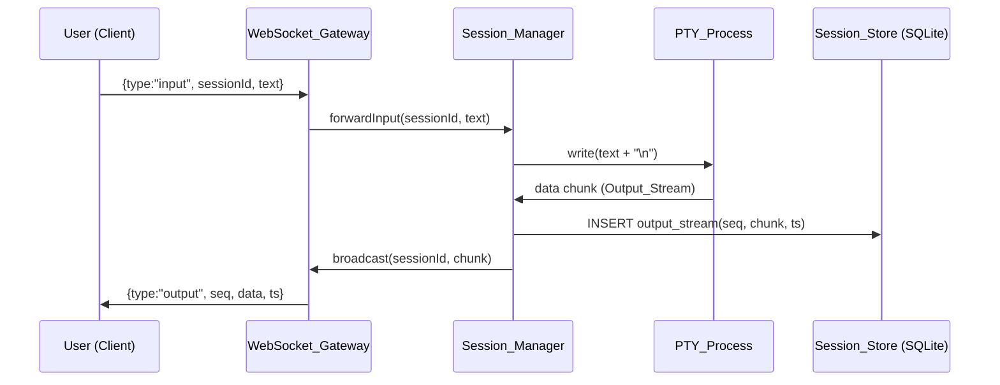

# Dokumen Desain

## Overview

KCG Bridge dibangun sebagai satu aplikasi Bun fullstack tunggal, memperluas template `bun-react-template` yang sudah ada di root workspace. Server (`src/index.ts`) menggunakan `Bun.serve()` dengan `routes` untuk HTTP API dan handler `websocket` bawaan Bun untuk `WebSocket_Gateway`. Frontend tetap memakai React 19 + Tailwind v4 + shadcn/ui yang sudah tersedia di `src/components/ui/*`.

Keputusan desain paling penting adalah cara menjalankan `PTY_Process`. Bun sejak versi 1.3.5 menyediakan API native `Bun.Terminal` yang membuat pseudo-terminal dan dapat dipasangkan ke `Bun.spawn` melalui opsi `terminal`, tanpa memerlukan native addon Node (`node-pty` tidak kompatibel dengan Bun runtime). Karena repo ini sudah mengikuti konvensi "Bun-first" (lihat `CLAUDE.md`: pakai `Bun.serve`, `bun:sqlite`, hindari paket Node equivalent), desain ini memakai `Bun.Terminal` + `Bun.spawn` sebagai mekanisme `PTY_Process`, dengan syarat Bun runtime versi >= 1.3.5 (versi terpasang saat ini: 1.4.0).

Persistensi menggunakan `bun:sqlite` (sudah termasuk dalam Bun, tidak perlu dependency tambahan) sebagai `Session_Store`. Satu file database (`data/kcg-bridge.sqlite`) menyimpan tabel `projects`, `sessions`, `session_status_history`, `output_stream`, dan `prompts`.

Frontend ditambah `PWA_Shell` (manifest + service worker) dan komponen baru (daftar Project, daftar Session, tampilan terminal/chat, kartu Interactive_Prompt, Folder_Browser) yang disusun di atas primitives shadcn/ui yang sudah ada (`Card`, `Button`, `Input`, `Select`, dst).

## Architecture

### Struktur Direktori (tambahan pada struktur yang sudah ada)

```
src/
  index.ts                  # entry Bun.serve, routes HTTP + upgrade WebSocket
  index.html                # entry HTML (sudah ada)
  frontend.tsx              # entry React (sudah ada)
  App.tsx                   # shell utama (project list -> session list -> session view)
  server/
    config.ts               # membaca Config_File, resolve Sandbox_Root
    db.ts                    # koneksi bun:sqlite + migrasi schema
    types.ts                 # tipe domain bersama (Session, Project, Prompt, dst)
    ws-protocol.ts           # tipe pesan WebSocket bersama client/server
    sandbox.ts               # validasi path terhadap Sandbox_Root
    project-manager.ts       # CRUD Project
    session-manager.ts       # lifecycle Session, orkestrasi PTY_Process
    pty-process.ts           # wrapper Bun.Terminal + Bun.spawn per Session
    prompt-detector.ts       # deteksi pola Interactive_Prompt dari Output_Stream
    websocket-gateway.ts     # registrasi koneksi, reattach, broadcast, cursor per client
    auth.ts                  # middleware otentikasi HTTP + WS
  components/
    ui/...                   # sudah ada (shadcn)
    project-list.tsx
    folder-browser.tsx
    session-list.tsx
    session-view.tsx
    prompt-card.tsx
    theme-toggle.tsx
  hooks/
    use-websocket.ts
    use-theme.ts
public/
  manifest.json
  sw.js
kcg-bridge.config.json       # Config_File (Sandbox_Root, dsb)
```

### Diagram Arsitektur



### Aliran Data Utama (Input -> Output)



Server dijalankan sebagai satu proses Bun jangka panjang (bukan serverless), sehingga `PTY_Process` tetap hidup di memori proses server selama server berjalan, terlepas dari status koneksi WebSocket ke Client mana pun (Requirement 2).

## Components and Interfaces

### `config.ts` — Config_File & Sandbox_Root

- Membaca `kcg-bridge.config.json` (path dapat dioverride via env `KCG_CONFIG_PATH`) saat startup.
- Skema minimal: `{ "sandboxRoot": "/abs/path" }`.
- Saat startup, resolve `sandboxRoot` dengan `fs.realpath`. Jika field tidak ada atau direktori tidak ditemukan, proses server exit dengan kode error dan log pesan jelas (Requirement 10.1).

### `db.ts` — Session_Store

- Membuka koneksi `bun:sqlite` (`new Database("data/kcg-bridge.sqlite", { create: true })`).
- Menjalankan `PRAGMA journal_mode = WAL;` untuk daya tahan tulis konkuren antara PTY writer dan reader HTTP/WS.
- Migrasi schema idempoten dijalankan di setiap startup (`CREATE TABLE IF NOT EXISTS ...`).
- Semua operasi tulis dibungkus try/catch; kegagalan tulis mengembalikan `Result`-style tuple `{ ok: false, error }` tanpa melakukan `DELETE`/`UPDATE` apa pun terhadap baris yang sudah ada (Requirement 3.2) — pola *insert-only* dipilih khusus untuk `output_stream` dan `session_status_history` agar requirement ini otomatis terpenuhi secara struktural.

### `pty-process.ts` — PTY_Process Wrapper

```ts
interface PtyHandle {
  sessionId: string;
  write(data: string): void;
  resize(cols: number, rows: number): void;
  kill(signal?: "SIGTERM" | "SIGKILL"): void;
  onData(cb: (chunk: string) => void): void;
  onExit(cb: (code: number | null, expected: boolean) => void): void;
}

function spawnPty(cmd: string[], cwd: string): PtyHandle;
```

- Implementasi memakai `new Bun.Terminal({ cols, rows, data: (term, data) => ... })` dipasangkan ke `Bun.spawn(cmd, { cwd, terminal })`.
- `kill()` mengirim `SIGTERM` lebih dulu; `Session_Manager` menjadwalkan `setTimeout` 5 detik yang memanggil `kill("SIGKILL")` apabila proses belum exit (Requirement 1.6).
- Flag `expected` pada `onExit` dipakai `Session_Manager` untuk membedakan exit yang diminta (`stopped`) dari exit tak terduga (`crashed`, Requirement 1.8).

### `session-manager.ts` — Session_Manager

Tanggung jawab: validasi tipe `CLI_Agent`, orkestrasi `PtyHandle`, transisi status Session, penerusan input (Interactive_Prompt response & free-text), serta rekonsiliasi saat startup.

```ts
type AgentType = "opencode" | "claude-code";
type SessionStatus = "running" | "stopped" | "crashed";

interface CreateSessionRequest { agentType: AgentType; projectId: string }
interface CreateSessionResult {
  ok: true; session: Session;
} | { ok: false; error: string };

function createSession(req: CreateSessionRequest): CreateSessionResult;
function listSessions(): Session[];
function stopSession(sessionId: string): { ok: boolean; error?: string };
function sendFreeTextInput(sessionId: string, text: string): { ok: boolean; error?: string };
function resolvePrompt(sessionId: string, promptId: string, response: PromptResponse): { ok: boolean; error?: string };
function reconcileOnStartup(): void; // dipanggil sekali saat server start
```

- `createSession` memvalidasi urutan: (1) `agentType` termasuk daftar didukung, (2) `Project` dengan `projectId` ada di store, (3) direktori kerja Project masih ada di filesystem. Kegagalan pada langkah manapun mengembalikan error spesifik tanpa membuat baris `sessions` berstatus `running` (Requirement 1.3, 1.4, 10.10, 10.11).
- `reconcileOnStartup` dijalankan sebelum server menerima koneksi: mengambil seluruh Session dengan status `running` dari store, dan karena proses restart berarti seluruh `PtyHandle` di memori lama sudah hilang, setiap Session tersebut langsung ditandai `crashed` dengan timestamp saat ini (Requirement 2.4).
- Proses shutdown (`process.on("SIGINT"/"SIGTERM")`) menuliskan status Session yang masih `running` ke `session_status_history` sebelum `process.exit`, dibatasi anggaran waktu 5 detik menggunakan `Promise.race` dengan timer (Requirement 2.3).

### `prompt-detector.ts` — Prompt_Detector

- Fungsi murni `detectPrompt(bufferedText: string): InteractivePromptDraft | null` dijalankan oleh `Session_Manager` setiap kali buffer Output_Stream terbaru (beberapa baris terakhir) berubah.
- Pola dikenali lewat kumpulan regex/heuristik yang dapat dikonfigurasi:
  - Konfirmasi y/n: `/\(y\/n\)|\[y\/N\]|do you want to proceed/i`
  - Izin eksekusi command / edit file: pola frasa khas CLI agent (mis. `Allow this command?`, `Apply this edit?`)
  - Menu pilihan: baris bernomor berurutan (`1) ...`, `2) ...`, dst) diikuti prompt pemilihan.
- Menghasilkan `InteractivePromptDraft` bertipe `"confirmation"` (tanpa/dengan opsi implisit Approve/Deny) atau `"menu"` (dengan `options: string[]` hasil parsing baris menu).
- Karena fungsi ini murni (input teks -> output draft prompt), inilah komponen utama yang diuji dengan property-based testing.

### `websocket-gateway.ts` — WebSocket_Gateway

- Menyimpan `Map<ws, { sessionId: string; lastSeqSent: number }>` di memori per koneksi (cursor per-client, bukan per-session, agar tiap Client independen — Requirement 5.2).
- Alur saat `open`/`message` bertipe `attach`:
  1. Validasi `sessionId` ada di store; jika tidak, kirim `{type:"error", code:"SESSION_NOT_FOUND", message}` lalu `ws.close()` (Requirement 4.3).
  2. Query seluruh baris `output_stream` milik Session terurut `seq ASC`, kirim sebagai satu pesan `{type:"history", chunks:[...]}` (Requirement 4.1).
  3. Set `lastSeqSent = seq` baris terakhir yang dikirim (atau 0 bila kosong).
  4. Query `prompts` dengan `status != 'resolved'`, kirim `{type:"prompt", prompt}` untuk masing-masing (Requirement 4.4).
  5. Daftarkan koneksi sebagai subscriber live untuk `sessionId`.
- Fungsi `broadcast(sessionId, chunk)` dipanggil `Session_Manager` setiap ada Output_Stream baru: iterasi seluruh subscriber `sessionId`, kirim hanya jika `chunk.seq > subscriber.lastSeqSent`, lalu update `lastSeqSent` (Requirement 4.2, 5.1, 5.2). Kegagalan `ws.send` pada satu subscriber (`try/catch`, lalu hapus subscriber dari map) tidak menghentikan iterasi ke subscriber lain (Requirement 5.3).

#### Protokol Pesan WebSocket

Format JSON dengan field `type` sebagai discriminator, didefinisikan di `ws-protocol.ts` dan dipakai bersama client/server.

**Client -> Server**

| type | payload | keterangan |
|---|---|---|
| `attach` | `{ sessionId }` | buka/reattach ke Session |
| `input` | `{ sessionId, text }` | free-form input (Requirement 7) |
| `prompt_response` | `{ sessionId, promptId, response }` | `response`: `"approve" \| "deny" \| "cancel" \| { option: string }` |
| `resize` | `{ sessionId, cols, rows }` | resize PTY sesuai viewport |

**Server -> Client**

| type | payload | keterangan |
|---|---|---|
| `history` | `{ sessionId, chunks: {seq, data, ts}[] }` | riwayat Output_Stream saat reattach |
| `output` | `{ sessionId, seq, data, ts }` | Output_Stream real-time |
| `prompt` | `{ sessionId, prompt: InteractivePrompt }` | Interactive_Prompt baru/belum resolved |
| `prompt_resolved` | `{ sessionId, promptId }` | notifikasi prompt sudah diselesaikan |
| `session_status` | `{ sessionId, status }` | perubahan status Session |
| `error` | `{ code, message }` | error umum (session not found, dst) |

### `project-manager.ts` — Project & Folder_Browser

```ts
function listDirectory(relativePath: string): { ok: true; entries: string[] } | { ok: false; error: string };
function createProject(name: string, relativePath: string): { ok: true; project: Project } | { ok: false; error: string };
function listProjects(): Project[];
```

- `listDirectory` dan `createProject` memakai `sandbox.ts` untuk memvalidasi path sebelum operasi apa pun terhadap filesystem.

### `sandbox.ts` — Validasi Sandbox_Root

```ts
function resolveWithinSandbox(sandboxRoot: string, userPath: string): { ok: true; realPath: string } | { ok: false; reason: "outside_sandbox" | "invalid_chars" };
```

- Langkah validasi: (1) tolak segmen path yang berisi `..` sebelum resolusi apa pun, (2) gabungkan `sandboxRoot` + `userPath` lalu panggil `fs.realpath` (mengikuti symlink), (3) pastikan hasil `realPath` berstatus `startsWith(sandboxRootReal + path.sep)` atau persis sama dengan `sandboxRootReal`. Jika salah satu gagal, kembalikan `outside_sandbox`. Nama direktori juga divalidasi terhadap karakter terlarang OS (mis. `< > : " | ? *` di Windows, `\0` di POSIX) untuk `invalid_chars` (Requirement 10.3, 10.7).
- Fungsi ini dipakai oleh `Folder_Browser` (list) dan `Project` creation (mkdir), sehingga logika validasi sandbox hanya ada di satu tempat.

### `auth.ts` — Akses Jaringan Terbatas

- `Bun.serve({ hostname: process.env.KCG_HOST ?? "127.0.0.1", port: ... })` — default loopback (Requirement 9.1).
- Bila `process.env.KCG_AUTH_ENABLED === "true"`, setiap request HTTP dan setiap upgrade WebSocket harus menyertakan header `Authorization: Bearer <token>` (atau `?token=` pada query string untuk upgrade WS, karena browser `WebSocket` API tidak mendukung header custom) yang cocok dengan `process.env.KCG_AUTH_TOKEN`. Tidak cocok/tidak ada -> HTTP 401 atau WS close code 4401 sebelum data lain diproses (Requirement 9.2, 9.3).

> Catatan keamanan: fitur ini membuka HTTP + WebSocket server yang dapat mengeksekusi proses CLI arbitrer di server. Meskipun default bind ke `127.0.0.1` dan otentikasi bersifat opsional (`WHERE` pada Requirement 9.2), operator **sangat disarankan** mengaktifkan `KCG_AUTH_ENABLED` di lingkungan apa pun yang dapat diakses lebih dari satu perangkat (mis. via VPN/LAN), karena tanpa otentikasi siapa pun di jaringan yang sama dapat mengontrol `CLI_Agent`.

### Frontend Components

- `App.tsx`: root shell, menyimpan state navigasi (Project list -> Session list per Project -> Session view), memakai `use-theme.ts` untuk dark mode.
- `folder-browser.tsx`: memanggil `GET /api/fs?path=...`, menampilkan breadcrumb + list sub-direktori, tombol "Pilih" untuk mengisi path Project baru.
- `project-list.tsx`: `GET/POST /api/projects`, form nama + Folder_Browser.
- `session-list.tsx`: `GET/POST /api/sessions`, pilih Project + tipe CLI_Agent.
- `session-view.tsx`: konsumen `use-websocket.ts`, render Output_Stream sebagai daftar pesan (dengan collapsible thinking block per pesan menyimpan state `Record<messageId, boolean>` default `true`/expanded), render `prompt-card.tsx` untuk Interactive_Prompt aktif, input field bebas.
- `prompt-card.tsx`: tombol Approve/Deny/Cancel untuk tipe `confirmation`, daftar opsi untuk tipe `menu`; klik "Cancel" memanggil handler yang sama dengan "Deny" (Requirement 8.5).
- `theme-toggle.tsx`: baca/tulis preferensi ke `localStorage["kcg-theme"]`, terapkan class `dark` di `<html>` saat mount berdasarkan nilai tersimpan (Requirement 8.6).

### PWA_Shell

- `public/manifest.json`: `name`, `short_name`, `start_url`, `display: "standalone"`, `icons` (reuse `logo.svg` sebagai basis, ditambah ukuran PNG yang digenerate).
- `public/sw.js`: strategi cache-first untuk asset statis (JS/CSS bundle hasil `build.ts`), pass-through (network-only) untuk `/api/*` dan koneksi WebSocket.
- Registrasi service worker dilakukan di `frontend.tsx`: `navigator.serviceWorker?.register("/sw.js")`.
- `index.html` ditambah `<link rel="manifest" href="/manifest.json">` dan meta tag `theme-color`.

## Data Models

### Skema SQLite

```sql
CREATE TABLE IF NOT EXISTS projects (
  id TEXT PRIMARY KEY,
  name TEXT NOT NULL UNIQUE,
  path TEXT NOT NULL UNIQUE,
  created_at INTEGER NOT NULL
);

CREATE TABLE IF NOT EXISTS sessions (
  id TEXT PRIMARY KEY,
  project_id TEXT NOT NULL REFERENCES projects(id),
  agent_type TEXT NOT NULL,
  cwd TEXT NOT NULL,
  status TEXT NOT NULL CHECK (status IN ('running','stopped','crashed')),
  created_at INTEGER NOT NULL,
  updated_at INTEGER NOT NULL
);

-- Append-only: tidak pernah UPDATE/DELETE, hanya INSERT (Requirement 3.3)
CREATE TABLE IF NOT EXISTS session_status_history (
  id INTEGER PRIMARY KEY AUTOINCREMENT,
  session_id TEXT NOT NULL REFERENCES sessions(id),
  status TEXT NOT NULL,
  changed_at INTEGER NOT NULL
);

-- Append-only: tidak pernah UPDATE/DELETE (Requirement 3.1, 3.2)
CREATE TABLE IF NOT EXISTS output_stream (
  id INTEGER PRIMARY KEY AUTOINCREMENT,
  session_id TEXT NOT NULL REFERENCES sessions(id),
  seq INTEGER NOT NULL,
  chunk TEXT NOT NULL,
  created_at INTEGER NOT NULL,
  UNIQUE(session_id, seq)
);
CREATE INDEX IF NOT EXISTS idx_output_stream_session_seq ON output_stream(session_id, seq);

CREATE TABLE IF NOT EXISTS prompts (
  id TEXT PRIMARY KEY,
  session_id TEXT NOT NULL REFERENCES sessions(id),
  type TEXT NOT NULL CHECK (type IN ('confirmation','menu')),
  options_json TEXT, -- JSON array of string, NULL untuk confirmation
  status TEXT NOT NULL CHECK (status IN ('pending','resolved')),
  created_at INTEGER NOT NULL,
  resolved_at INTEGER
);
CREATE INDEX IF NOT EXISTS idx_prompts_session_status ON prompts(session_id, status);
```

`seq` pada `output_stream` adalah counter per-Session (disimpan juga di memori `Session_Manager` selama proses berjalan) yang menjadi basis mekanisme *offset* pada reattach (Requirement 4.2) — bukan `id` autoincrement global, agar urutan tetap konsisten meski di masa depan tabel dipartisi ulang.

### Tipe Domain (TypeScript, `server/types.ts`)

```ts
interface Project { id: string; name: string; path: string; createdAt: number }

interface Session {
  id: string;
  projectId: string;
  agentType: "opencode" | "claude-code";
  cwd: string;
  status: "running" | "stopped" | "crashed";
  createdAt: number;
  updatedAt: number;
}

interface OutputChunk { sessionId: string; seq: number; data: string; ts: number }

interface InteractivePrompt {
  id: string;
  sessionId: string;
  type: "confirmation" | "menu";
  options: string[] | null;
  status: "pending" | "resolved";
  createdAt: number;
  resolvedAt: number | null;
}

type PromptResponse = "approve" | "deny" | "cancel" | { option: string };
```

## Correctness Properties

*A property is a characteristic or behavior that should hold true across all valid executions of a system-essentially, a formal statement about what the system should do. Properties serve as the bridge between human-readable specifications and machine-verifiable correctness guarantees.*

Sebagian besar logika inti KCG Bridge (Session_Manager, Prompt_Detector, WebSocket_Gateway cursor tracking, Session_Store, sandbox validator, Project_Manager) adalah logika murni yang dapat diuji terlepas dari proses CLI_Agent atau koneksi WebSocket sungguhan (dengan mock pada `PtyHandle` dan `ws.send`), sehingga property-based testing sangat relevan untuk fitur ini.

### Property 1: Pembuatan Session valid

*For any* kombinasi `agentType` yang termasuk daftar tipe didukung dan `Project` yang tersimpan dengan direktori kerja yang ada di filesystem, `createSession` menghasilkan `Session` baru dengan identitas unik, status `"running"`, `cwd` sama dengan path Project tersebut, dan tepat satu `PtyHandle` terasosiasi dengannya.

**Validates: Requirements 1.1, 1.2, 10.9**

### Property 2: Pembuatan Session dengan kondisi tidak valid selalu ditolak

*For any* permintaan pembuatan Session dengan salah satu dari: `agentType` di luar daftar didukung, `projectId` yang tidak ada di Session_Store, atau `Project` valid namun direktori kerjanya sudah tidak ada di filesystem, `createSession` mengembalikan hasil gagal dengan pesan error, dan tidak ada baris `sessions` baru berstatus `"running"` tercatat di Session_Store.

**Validates: Requirements 1.3, 10.10, 10.11**

### Property 3: Daftar entitas selalu lengkap

*For any* himpunan `Session` atau `Project` yang tersimpan di Session_Store, memanggil `listSessions()`/`listProjects()` mengembalikan tepat seluruh entitas tersebut (jumlah dan isi sama), tanpa entitas yang hilang atau duplikat.

**Validates: Requirements 1.5, 10.8**

### Property 4: Penghentian Session tidak valid selalu ditolak

*For any* `sessionId` yang tidak ada di Session_Store, atau `Session` yang ada namun berstatus selain `"running"`, `stopSession` mengembalikan hasil gagal dengan pesan error, dan tidak mengubah status `Session` mana pun di Session_Store.

**Validates: Requirements 1.7**

### Property 5: Exit tak terduga menghasilkan status crashed

*For any* `Session` berstatus `"running"` yang `PtyHandle`-nya memanggil `onExit` dengan kode keluar bukan nol tanpa didahului pemanggilan `stopSession`, status `Session` tersebut berubah menjadi `"crashed"` dan satu baris baru tercatat di `session_status_history` dengan timestamp kejadian.

**Validates: Requirements 1.8**

### Property 6: Status Session tidak terpengaruh disconnect WebSocket

*For any* `Session` berstatus `"running"` dengan `PtyHandle` yang masih hidup, memutus seluruh koneksi WebSocket yang ter-attach ke Session tersebut tidak mengubah status Session (tetap `"running"`).

**Validates: Requirements 2.2**

### Property 7: Rekonsiliasi startup menandai Session tanpa proses sebagai crashed

*For any* himpunan `Session` yang tercatat berstatus `"running"` di Session_Store namun tidak memiliki `PtyHandle` aktif di memori (situasi setelah restart server), memanggil `reconcileOnStartup()` mengubah seluruh Session tersebut menjadi `"crashed"` dengan timestamp tercatat, dan tidak mengubah status Session lain yang bukan `"running"`.

**Validates: Requirements 2.4**

### Property 8: Round-trip penyimpanan Output_Stream

*For any* urutan potongan teks yang disimpan ke `output_stream` untuk satu `sessionId` (dengan `seq` naik berurutan), membaca kembali Output_Stream untuk `sessionId` tersebut mengembalikan potongan-potongan dalam urutan `seq` yang identik dengan urutan penyimpanannya.

**Validates: Requirements 3.1, 3.4**

### Property 9: Riwayat status bersifat append-only

*For any* urutan perubahan status yang diterapkan pada satu `Session`, jumlah baris `session_status_history` milik Session tersebut tidak pernah berkurang setelah operasi apa pun, dan seluruh baris yang pernah ditulis sebelumnya tetap dapat dibaca kembali persis sama setelah penulisan status baru.

**Validates: Requirements 3.3**

### Property 10: Query terhadap Session tidak ditemukan

*For any* `sessionId` yang belum pernah dibuat di Session_Store, membaca Output_Stream atau riwayat status untuk `sessionId` tersebut mengembalikan indikasi "tidak ditemukan" tanpa mengembalikan data Output_Stream atau status apa pun.

**Validates: Requirements 3.5**

### Property 11: Reattach mengirim riwayat sesuai urutan sebelum data baru

*For any* `Session` dengan riwayat `output_stream` tersimpan, saat koneksi WebSocket baru mengirim `attach`, pesan `history` yang dikirim `WebSocket_Gateway` berisi seluruh chunk tersimpan terurut `seq` naik, dan setiap chunk `output` yang dikirim setelahnya pada koneksi yang sama memiliki `seq` lebih besar dari seluruh `seq` pada pesan `history`.

**Validates: Requirements 4.1**

### Property 12: Tidak ada duplikasi atau chunk terlewat setelah reattach

*For any* koneksi WebSocket dengan cursor `lastSeqSent` tertentu dan sembarang urutan Output_Stream baru yang dihasilkan setelahnya, `WebSocket_Gateway` mengirim ke koneksi tersebut tepat satu kali untuk setiap chunk dengan `seq > lastSeqSent`, dalam urutan `seq` naik, tanpa mengirim ulang chunk dengan `seq <= lastSeqSent` dan tanpa melewatkan chunk mana pun di antaranya.

**Validates: Requirements 4.2**

### Property 13: Reattach ke Session tidak ditemukan menghasilkan error

*For any* `sessionId` yang tidak ada di Session_Store, mengirim `attach` dengan `sessionId` tersebut menghasilkan pesan `error` dengan kode "session tidak ditemukan" yang dikirim ke Client sebelum koneksi ditutup, dan tidak ada pesan `history` atau `output` yang dikirim.

**Validates: Requirements 4.3**

### Property 14: Reattach mengirim seluruh prompt belum resolved

*For any* `Session` dengan himpunan `Interactive_Prompt` berstatus campuran `"pending"` dan `"resolved"`, setelah reattach selesai mengirim riwayat, `WebSocket_Gateway` mengirim tepat satu pesan `prompt` untuk setiap prompt berstatus `"pending"` milik Session tersebut, dan tidak mengirim pesan `prompt` untuk prompt berstatus `"resolved"`.

**Validates: Requirements 4.4**

### Property 15: Broadcast konsisten ke banyak Client

*For any* sejumlah koneksi Client yang ter-attach ke `Session` yang sama dan sembarang urutan Output_Stream baru yang dihasilkan, setiap Client menerima seluruh chunk tersebut persis satu kali dan dalam urutan `seq` yang identik dengan urutan chunk dihasilkan (tidak ada chunk yang dilewati atau digandakan untuk Client mana pun).

**Validates: Requirements 5.1, 5.2**

### Property 16: Kegagalan satu Client tidak memengaruhi Client lain

*For any* himpunan Client yang ter-attach ke `Session` yang sama di mana satu atau lebih Client disimulasikan gagal menerima pesan (`ws.send` melempar error), broadcast Output_Stream ke Client lain pada Session tersebut tetap lengkap dan berurutan sesuai Property 15.

**Validates: Requirements 5.3**

### Property 17: Deteksi pola Interactive_Prompt

*For any* teks Output_Stream yang mengandung pola konfirmasi y/n, izin eksekusi command, atau edit file, `detectPrompt` mengembalikan draft prompt bertipe `"confirmation"`; dan *for any* teks yang mengandung pola daftar pilihan menu bernomor, `detectPrompt` mengembalikan draft prompt bertipe `"menu"` dengan `options` yang sama dengan daftar pilihan pada teks tersebut.

**Validates: Requirements 6.1, 6.2**

### Property 18: Respon valid diteruskan dan menandai prompt resolved

*For any* `Interactive_Prompt` berstatus `"pending"` dan respon yang valid untuknya (`"approve"`, `"deny"`, atau salah satu `options` bila bertipe `"menu"`), `resolvePrompt` meneruskan representasi respon tersebut sebagai satu pemanggilan `write` ke `PtyHandle` dari Session terkait, dan mengubah status prompt tersebut menjadi `"resolved"` dengan `resolvedAt` tercatat.

**Validates: Requirements 6.3, 6.4**

### Property 19: Respon tidak valid selalu ditolak tanpa efek samping

*For any* dari kondisi berikut: `promptId` tidak ada di Session_Store, prompt yang dimaksud sudah berstatus `"resolved"`, atau respon berupa opsi yang bukan bagian dari `options` prompt bertipe `"menu"` tersebut, `resolvePrompt` mengembalikan hasil gagal dengan pesan error, tidak memanggil `write` pada `PtyHandle` apa pun, dan tidak mengubah status prompt manapun di Session_Store.

**Validates: Requirements 6.5, 6.6**

### Property 20: Respon Cancel tidak meneruskan input

*For any* `Interactive_Prompt` berstatus `"pending"`, mengirim respon `"cancel"` mengubah status prompt tersebut menjadi `"resolved"` tanpa memanggil `write` pada `PtyHandle` dari Session terkait.

**Validates: Requirements 6.7**

### Property 21: Free-text valid diteruskan utuh dengan newline

*For any* string dengan panjang 1 hingga 10.000 karakter yang bukan seluruhnya whitespace, dan `Session` berstatus `"running"`, `sendFreeTextInput` memanggil `write` pada `PtyHandle` Session tersebut dengan argumen sama dengan string input diikuti tepat satu karakter newline (`\n`).

**Validates: Requirements 7.1**

### Property 22: Free-text kosong atau melebihi batas selalu ditolak

*For any* string yang seluruhnya terdiri dari karakter whitespace (termasuk string kosong), atau string dengan panjang lebih dari 10.000 karakter, `sendFreeTextInput` mengembalikan hasil gagal dengan pesan error yang sesuai (teks kosong atau batas panjang terlampaui) dan tidak memanggil `write` pada `PtyHandle` apa pun.

**Validates: Requirements 7.2, 7.3**

### Property 23: Free-text pada Session tidak aktif selalu ditolak

*For any* string valid (1-10.000 karakter, bukan whitespace) dan `Session` berstatus `"stopped"` atau `"crashed"`, `sendFreeTextInput` mengembalikan hasil gagal dengan pesan error "Session tidak aktif" dan tidak memanggil `write` pada `PtyHandle` apa pun.

**Validates: Requirements 7.4**

### Property 24: Free-text tidak mengubah status Interactive_Prompt

*For any* `Session` berstatus `"running"` yang memiliki satu atau lebih `Interactive_Prompt` berstatus `"pending"`, mengirim free-text valid melalui `sendFreeTextInput` tetap memanggil `write` pada `PtyHandle` sesuai Property 21, dan tidak mengubah status `"pending"` milik prompt manapun pada Session tersebut.

**Validates: Requirements 7.5**

### Property 25: Toggle collapsible thinking independen antar pesan

*For any* himpunan pesan dan sembarang urutan aksi toggle collapsible yang diterapkan pada masing-masing pesan secara acak, status tampil/tersembunyi setiap pesan setelah seluruh aksi diterapkan sama dengan hasil XOR jumlah toggle ganjil/genap yang diterapkan pada pesan itu sendiri terhadap nilai default `true` (expanded), dan tidak terpengaruh oleh jumlah toggle yang diterapkan pada pesan lain.

**Validates: Requirements 8.3**

### Property 26: Otentikasi konsisten terhadap kredensial

*For any* permintaan HTTP atau permintaan upgrade WebSocket ketika `KCG_AUTH_ENABLED` aktif, permintaan diterima untuk diproses lebih lanjut jika dan hanya jika kredensial yang disertakan (header/query token) sama dengan kredensial terkonfigurasi; untuk seluruh kombinasi kredensial lain (tidak ada, salah, atau kosong), permintaan ditolak dengan pesan error otentikasi.

**Validates: Requirements 9.2, 9.3**

### Property 27: Folder_Browser mengembalikan persis sub-direktori dalam sandbox

*For any* struktur direktori di dalam `Sandbox_Root` dan sembarang sub-path valid di dalamnya, `listDirectory` mengembalikan tepat himpunan nama sub-direktori langsung dari path tersebut, tanpa entri yang hilang, tanpa entri tambahan, dan tanpa entri dari luar path yang diminta.

**Validates: Requirements 10.2**

### Property 28: Path di luar Sandbox_Root selalu ditolak

*For any* path yang setelah resolusi (termasuk penyelesaian `..`, path absolut, atau symlink) berada di luar `Sandbox_Root`, atau mengandung karakter yang tidak valid untuk nama direktori pada OS server, `resolveWithinSandbox` mengembalikan hasil gagal dengan alasan yang sesuai (`outside_sandbox` atau `invalid_chars`), dan baik `listDirectory` maupun `createProject` tidak melakukan operasi filesystem apa pun terhadap path tersebut.

**Validates: Requirements 10.3, 10.7**

### Property 29: Pembuatan Project unik berhasil round-trip

*For any* `name` dan `path` yang belum dipakai oleh `Project` manapun di Session_Store dan `path` berada di dalam `Sandbox_Root`, `createProject` berhasil, direktori pada `path` tersebut ada di filesystem setelahnya (dibuat jika belum ada), dan memanggil `listProjects()` sesudahnya menyertakan `Project` baru tersebut dengan `name` dan `path` yang sama.

**Validates: Requirements 10.4**

### Property 30: Nama atau path Project duplikat selalu ditolak

*For any* `Project` yang sudah tersimpan di Session_Store, permintaan `createProject` baru dengan `name` yang sama (path apa pun) atau `path` yang sama (nama apa pun) selalu mengembalikan hasil gagal dengan pesan error yang sesuai ("nama sudah digunakan" atau "path sudah digunakan"), dan tidak menambah baris `projects` baru.

**Validates: Requirements 10.5, 10.6**

## Error Handling

Pendekatan penanganan error dibuat konsisten di seluruh layer:

- **Layer domain (`session-manager.ts`, `project-manager.ts`, dst)**: setiap fungsi publik mengembalikan tipe hasil diskriminasi `{ ok: true; data } | { ok: false; error: string }` — bukan `throw` — untuk kondisi kegagalan yang merupakan bagian dari kontrak (validasi gagal, entitas tidak ditemukan, konflik). Ini membuat kegagalan menjadi bagian dari tipe yang harus ditangani caller, dan langsung dites lewat property test tanpa perlu `try/catch` di test.
- **Layer HTTP (`src/index.ts` routes)**: hasil `{ ok: false }` dari layer domain dipetakan ke status code yang sesuai (`400` validasi, `404` tidak ditemukan, `409` konflik nama/path) dengan body `{ error: string }`. Error tak terduga (bug, exception dari `bun:sqlite`) ditangkap di level route handler dan dikembalikan sebagai `500` dengan pesan generik, dicatat ke `console.error` (Requirement 3.2 — kegagalan Session_Store tidak boleh merusak data yang sudah tersimpan).
- **Layer WebSocket (`websocket-gateway.ts`)**: error domain dikirim sebagai pesan `{type:"error", code, message}` ke Client yang bersangkutan tanpa menutup koneksi (kecuali kasus `attach` ke Session tidak ditemukan, yang menutup koneksi sesuai Requirement 4.3). Exception saat `ws.send` ke satu Client ditangkap per-Client agar tidak mengganggu broadcast ke Client lain (Requirement 5.3).
- **Layer PTY_Process**: kegagalan spawn (`Bun.spawn` melempar atau proses langsung exit dengan error) ditangkap di `session-manager.ts` saat `createSession`, menghasilkan status `"crashed"` dan pesan error tanpa pernah menandai Session sebagai `"running"` di Session_Store (Requirement 1.4).
- **Sandbox violations**: seluruh operasi filesystem (list, mkdir) selalu melewati `resolveWithinSandbox` terlebih dahulu; kegagalan validasi mengembalikan error sebelum ada satu pun panggilan `fs` yang dieksekusi, mencegah TOCTOU sederhana pada kasus umum (validasi ulang tetap dilakukan tepat sebelum operasi tulis untuk mengurangi race symlink).
- **Startup fatal errors**: `Config_File` tidak valid atau `Sandbox_Root` tidak ditemukan menghentikan proses server (`process.exit(1)`) dengan log jelas, karena ini prasyarat keamanan yang tidak boleh diabaikan (Requirement 10.1).

## Testing Strategy

**Pendekatan dual testing**:
- **Unit test**: memverifikasi contoh spesifik, edge case (mis. batas tepat 10.000/10.001 karakter, path `"../etc"`, nama Project dengan karakter unicode), dan error condition per Requirement yang tidak tercakup sebagai property (mis. Requirement 1.6 timing force-kill 5 detik, Requirement 8.1/8.2/8.4/8.6/9.1/10.1 yang bersifat konfigurasi/UI sederhana — lihat catatan di bawah).
- **Property test**: memverifikasi 30 Correctness Properties di atas menggunakan library **fast-check** (pilihan standar untuk property-based testing di ekosistem TypeScript/JavaScript, kompatibel dengan `bun test`). Setiap property diimplementasikan sebagai **satu** test `fc.assert(fc.property(...), { numRuns: 100 })` (minimum 100 iterasi), dan diberi komentar tag `// Feature: kcg-bridge, Property N: <judul>` tepat di atas test tersebut agar tertelusur ke design.md.

**Mocking boundary**: `PtyHandle` (Bun.Terminal/Bun.spawn) dan `WebSocket` (`ws.send`) dimock di seluruh property test agar test murni menguji logika `Session_Manager`, `Prompt_Detector`, `WebSocket_Gateway`, `Sandbox`, dan `Project_Manager` tanpa proses OS sungguhan atau koneksi jaringan sungguhan — sejalan dengan panduan "gunakan mock untuk PBT, integration test untuk end-to-end".

**Requirement yang TIDAK dijadikan property** (dan strategi alternatifnya):
- 1.4, 1.6 (timing force-kill, kegagalan spawn satu-kali) — unit test dengan `PtyHandle` mock yang disimulasikan gagal/lambat, memakai fake timer.
- 2.1, 2.3, 3.2, 3.6 — integration test 1-3 skenario (proses tetap hidup tanpa Client; shutdown dalam budget waktu; kegagalan tulis storage; restart proses dengan file SQLite yang sama), karena menguji daya tahan proses/OS/disk, bukan logika transformasi input.
- 8.1, 8.7 — pemeriksaan konfigurasi statis (manifest ada & valid) dan pengecekan layout responsif; ini pengujian visual yang membutuhkan rendering browser sungguhan, di luar cakupan otomatisasi PBT/unit — dicatat sebagai verifikasi manual/visual regression terpisah.
- 8.2, 8.4, 8.5, 8.6, 9.1, 10.1 — example-based unit test (interaksi UI sederhana dua-state, rendering satu jenis kartu, konfigurasi startup dengan sedikit kombinasi kasus).

**Unit test balance**: unit test difokuskan pada contoh representatif, integrasi antar komponen (mis. `Session_Manager` -> `WebSocket_Gateway` -> `Session_Store` end-to-end dengan mock PTY), dan edge case; tidak menduplikasi cakupan luas yang sudah ditangani property test.

**Test runner**: `bun test` (bawaan Bun) dipakai untuk seluruh unit test dan property test (fast-check berjalan baik di atas `bun test`), tanpa dependency test runner tambahan.
